# Whetstone: Current State — 2026-04-05

> Whetstone sharpens the tools that write your code.

**Version:** 0.1.1 | **Language:** Rust (edition 2021, MSRV 1.75) | **Binaries:** `whetstone`, `wh`

---

## What Whetstone Does

Whetstone is a Rust CLI that derives coding rules from the documentation of your actual project dependencies. It scans manifests, fetches docs (prioritising `llms.txt` files), and prepares structured context so an LLM agent can propose rules. Approved rules are then used to generate native test files, linter config overlays, and agent context files — all kept in sync as dependencies evolve.

The key insight: **the agent running Whetstone is the LLM**. The binary handles all deterministic work; the agent handles judgment (reading docs, proposing rules, presenting them for approval). No separate API key required.

---

## Architecture Overview

```mermaid
flowchart TB
    subgraph INPUT["Input Sources"]
        M1[pyproject.toml]
        M2[package.json]
        M3[Cargo.toml]
        M4[requirements.txt]
        REG_NPM[npm Registry]
        REG_PYPI[PyPI API]
        REG_CRATES[crates.io API]
        DOCS[Doc Sites / llms.txt]
        GIT[Git History]
        TRANSCRIPTS[Agent Transcripts]
        PR[PR Comments]
    end

    subgraph CLI["CLI Commands (cli.rs)"]
        INIT["init\n(detect-deps)"]
        SOURCES["set-sources\n(resolve-sources)"]
        DOCTOR["doctor\n(orchestrator)"]
        STATUS["status"]
        CI["ci\n(ci-check)"]
        CONTEXT["context\n(generate-context)"]
        TESTS["tests\n(generate-tests)"]
        VALIDATE["validate\n(validate-rules)"]
        PATTERNS["patterns\n(detect-patterns)"]
    end

    subgraph CORE["Core Modules"]
        DETECT["detect/\nManifest parsing\nDedup & counts\nDrift detection"]
        RESOLVE["resolve/\nRegistry lookup\nllms.txt probing\nParallel fetch"]
        RULES["rules.rs\nSchema validation\nRule loading"]
        GEN_CTX["generate_context.rs\nMulti-format output"]
        GEN_TEST["generate_tests.rs\nTest + lint gen"]
        STATUS_MOD["status.rs\nFreshness scoring"]
        CI_MOD["ci_check.rs\nCI gate logic"]
        DETECT_PAT["detect_patterns.rs\nPattern mining"]
    end

    subgraph STATE["State Layer (whetstone/.state/)"]
        S_MANIFEST["manifests.json\nSHA256 fingerprints"]
        S_INVENTORY["inventory.json\nLifecycle states"]
        S_CACHE["source-cache.json\nResolution results + TTL"]
        S_REFRESH["refresh-log.json\nAudit trail"]
    end

    subgraph OUTPUT["Outputs"]
        RULE_FILES["whetstone/rules/**/*.yaml\nApproved rules"]
        CTX_FILES["whetstone/context/\nagents.md, claude.md\n.cursorrules, etc."]
        TEST_FILES["whetstone/evals/\npytest, vitest, cargo"]
        LINT_FILES["whetstone/lint/\nruff, biome overlays"]
        JSON_OUT["JSON stdout\n(machine output)"]
        HUMAN_OUT["ASCII reports\n(terminal output)"]
    end

    subgraph EXTERNAL["External: LLM Agent"]
        AGENT["Agent reads extraction_context\nProposes candidate rules\nUser approves/rejects"]
    end

    %% Input → Detect
    M1 & M2 & M3 & M4 --> DETECT

    %% Detect → Resolve
    DETECT -->|dependency list| RESOLVE
    REG_NPM & REG_PYPI & REG_CRATES --> RESOLVE
    DOCS --> RESOLVE

    %% Commands → Modules
    INIT --> DETECT
    SOURCES --> RESOLVE
    DOCTOR -->|"step 1"| DETECT
    DOCTOR -->|"step 2"| RESOLVE
    DOCTOR -->|"step 3: handoff"| AGENT
    STATUS --> STATUS_MOD
    CI --> CI_MOD --> STATUS_MOD
    CONTEXT --> GEN_CTX
    TESTS --> GEN_TEST
    VALIDATE --> RULES
    PATTERNS --> DETECT_PAT

    %% Pattern sources
    GIT & TRANSCRIPTS & PR --> DETECT_PAT

    %% State interactions
    DETECT <--> S_MANIFEST
    DETECT <--> S_INVENTORY
    RESOLVE <--> S_CACHE
    RESOLVE <--> S_INVENTORY
    RESOLVE <--> S_REFRESH
    STATUS_MOD --> S_INVENTORY

    %% Rules flow
    AGENT -->|"approved YAML"| RULE_FILES
    RULE_FILES --> RULES
    RULES --> GEN_CTX
    RULES --> GEN_TEST
    RULES --> STATUS_MOD

    %% Outputs
    GEN_CTX --> CTX_FILES
    GEN_TEST --> TEST_FILES
    GEN_TEST --> LINT_FILES
    STATUS_MOD --> JSON_OUT
    STATUS_MOD --> HUMAN_OUT

    style DOCTOR fill:#2d6a4f,color:#fff
    style AGENT fill:#e76f51,color:#fff
    style RULE_FILES fill:#264653,color:#fff
```



---

## The Canonical Workflow

| Step | Who | Command | What Happens |
|------|-----|---------|--------------|
| 1. Detect | Binary | `whetstone doctor` or `whetstone init` | Scan manifests, parse deps, deduplicate, compute counts |
| 2. Resolve | Binary | `whetstone doctor` or `whetstone set-sources` | Query registries, probe for `llms.txt`, cache results |
| 3. Extract | Agent | *(reads extraction_context from doctor output)* | LLM reads docs, proposes candidate rules |
| 4. Approve | User + Agent | *(manual review)* | Rules persisted to `whetstone/rules/**/*.yaml` |
| 5. Generate | Binary | `whetstone context` + `whetstone tests` | Produce agent context files, test files, lint configs |
| 6. Monitor | Binary | `whetstone status` / `whetstone ci` | Track freshness, drift, health score |

The `doctor` command orchestrates steps 1-2 and prepares the handoff for step 3. It is the primary entry point.

---

## CLI Commands

| Command | Aliases | Purpose |
|---------|---------|---------|
| `init` | `deps`, `detect-deps` | Scan manifests, detect all dependencies |
| `set-sources` | `sources`, `resolve-sources` | Resolve doc URLs, fetch content |
| `doctor` | `start` | Full pipeline: detect → resolve → extraction handoff |
| `status` | — | Health score, freshness, drift detection |
| `context` | `generate-context` | Generate agent context files from approved rules |
| `tests` | `generate-tests` | Generate test files + linter configs from rules |
| `validate` | `validate-rules` | Validate rule YAML against schema |
| `patterns` | `detect-patterns` | Mine style directives from transcripts, git, PRs |
| `ci` | `check`, `ci-check` | Lightweight CI freshness gate |

All commands accept `--project-dir` (default `.`) and `--json` (auto-enabled when piped).

---

## Module Breakdown

### Detection (`src/detect/`)

**Responsibility:** Find and parse all dependency manifests in the project tree.

| Parser | File Types | Ecosystems |
|--------|-----------|------------|
| `python.rs` | `pyproject.toml` (PEP 621, Poetry), `requirements.txt` | PyPI |
| `typescript.rs` | `package.json` | npm |
| `rust_lang.rs` | `Cargo.toml` | crates.io |

**Key behaviors:**
- Recursive walk with 37 skip-directories (node_modules, target, .git, etc.)
- Deduplication by `(name, language, dev)` triple across manifests
- Incremental mode: SHA256 fingerprints of manifests, only re-process changed files
- Drift detection: compares manifest versions against versions in approved rules
- Monorepo detection and workspace grouping
- Scoped npm package grouping in human output

### Resolution (`src/resolve/`)

**Responsibility:** Fetch documentation content for each dependency via registry APIs.

**Per-dependency flow:**
1. Query registry API (npm, PyPI, crates.io) for metadata
2. Extract documentation URL from metadata fields
3. Probe for `llms-full.txt` then `llms.txt` at various URL suffixes
4. Fall back to `docs_url_only` if no llms.txt found
5. Compute SHA256 content hash for change detection
6. Compute freshness (source age, content staleness, confidence level)

**Performance features:**
- Parallel resolution via rayon thread pool (auto-tuned: 1→6→12 workers)
- 7-day TTL cache with content hash comparison
- Checkpoint after each resolution (crash-safe)
- Progress bar (indicatif, hidden when piped)
- Resumable: `--resume` skips already-resolved, `--retry-failed` only retries errors

### Doctor (`src/doctor.rs`) — The Orchestrator

The flagship command. Coordinates detect → resolve → extraction handoff with smart defaults.

**Key features:**
- **Fast-first strategy:** On fresh start with >10 deps, only resolves top 10 by score. Use `--resume` for the rest.
- **Dependency ranking:** Scores based on runtime vs dev (+100), source type (+10-50), multi-manifest usage, staleness
- **Classification:** Buckets deps into cached/stale/missing/failed before resolution
- **Extraction handoff:** Groups results by readiness (ready_now, resolved_low, failed) with actionable recommendations
- 887 lines — the largest module

### Rules (`src/rules.rs`)

**Schema for approved rules:**

```yaml
source:
  name: "pydantic"
  docs_url: "https://docs.pydantic.dev/"
  llms_txt: "https://docs.pydantic.dev/llms.txt"
  version: "2.0.1"
  content_hash: "sha256:abc123..."

rules:
  - id: pydantic.model-config
    severity: must          # must | should | may
    confidence: high        # high | medium
    category: convention    # migration | default | convention | breaking-change | semantic
    description: "Use model_config dict instead of class Config"
    source_url: "https://docs.pydantic.dev/..."
    signals:
      - strategy: ast       # ast | pattern | lint_proxy | ai
        description: "Detect class Config inside BaseModel subclass"
    golden_examples:
      - code: "class Config: ..."
        verdict: fail
      - code: "model_config = ConfigDict(...)"
        verdict: pass
```

**Validation checks:** required fields, valid enums, signal strategies, golden example structure.

### State Layer (`src/state/`)

Four stores, all JSON files in `whetstone/.state/`, all using atomic write (write tmp → rename):

| Store | File | Tracks |
|-------|------|--------|
| `ManifestStore` | `manifests.json` | File SHA256 hashes, first/last seen timestamps |
| `InventoryStore` | `inventory.json` | Lifecycle state per dependency (Discovered → ... → Approved) |
| `SourceCacheStore` | `source-cache.json` | Resolution results with 7-day TTL |
| `RefreshLog` | `refresh-log.json` | Append-only audit trail (max 200 entries) |

**Dependency lifecycle:**
```
Discovered → Queued → Resolving → Resolved → ExtractionReady → Extracted → Approved
                                                                           ↗
                                                              Stale ──────┘
                                         Failed ─────────────────────────────→ (retry)
```

### Generation

**`generate_context.rs`** — Produces agent context files from approved rules:
- `agents.md` (universal), `claude.md` (Claude Code), `.cursorrules` (Cursor), `copilot-instructions.md`, `.windsurfrules`, `codex.md`
- Separates rules into "use" (preferred patterns) and "avoid" (antipatterns) by category
- Writes to `whetstone/context/`

**`generate_tests.rs`** — Produces test files and linter config overlays:
- pytest files + ruff overlay (Python)
- vitest files + biome overlay (TypeScript)
- cargo test files + clippy overlay (Rust)
- Each test validates one rule's signals using golden examples
- Writes to `whetstone/evals/` and `whetstone/lint/`

### Status & CI (`src/status.rs`, `src/ci_check.rs`)

**Health score (0-100) computed from:**
- Freshness (days since last extraction)
- Rule count and high-confidence ratio
- Deterministic signal coverage (ast/pattern/lint_proxy vs ai)
- Pending updates (drifted deps)

**Status labels:** `healthy` (>80), `needs_review` (50-80), `stale` (<50), `no_rules`, `not_initialized`

**CI gate:** Maps status to pass/fail with configurable threshold (`--fail-on stale|needs_review`). Can emit GitHub PR comment markdown.

### Pattern Mining (`src/detect_patterns.rs`)

Mines coding style directives from three sources:
- **Agent transcripts** (`.claude/projects`, `.cursor/projects`) — JSONL conversation logs
- **Git history** — commit messages with style/refactor keywords
- **PR comments** — feedback patterns from code review

Looks for directive patterns ("always use X", "never use Y"), corrections, version/deprecation signals, and style keywords.

---

## Dependencies

| Crate | Purpose |
|-------|---------|
| `clap` (derive) | CLI argument parsing |
| `serde` + `serde_json` + `serde_yaml` | Serialization |
| `reqwest` (blocking, rustls-tls) | HTTP requests to registries and doc sites |
| `rayon` | Parallel resolution |
| `regex` | Pattern matching in detection and pattern mining |
| `sha2` | SHA256 hashing for manifests and content |
| `toml` | TOML manifest parsing |
| `chrono` | Timestamps |
| `indicatif` | Terminal progress bars |
| `anyhow` | Error handling |

---

## File Layout

```
whetstone/
├── src/
│   ├── main.rs                    Entry point → cli::run()
│   ├── cli.rs                     Command routing (761 LOC)
│   ├── doctor.rs                  Orchestrator (887 LOC)
│   ├── types.rs                   Language, LifecycleState, Dependency
│   ├── config.rs                  whetstone.yaml loading
│   ├── output.rs                  JSON printing, ReportBuilder
│   ├── rules.rs                   Rule schema + validation
│   ├── status.rs                  Health scoring
│   ├── ci_check.rs                CI gate logic
│   ├── generate_context.rs        Agent context generation
│   ├── generate_tests.rs          Test + lint config generation
│   ├── detect_patterns.rs         Pattern mining
│   ├── detect/
│   │   ├── mod.rs                 Detection orchestration (551 LOC)
│   │   ├── walk.rs                Filesystem traversal
│   │   ├── python.rs              pyproject.toml / requirements.txt
│   │   ├── typescript.rs          package.json
│   │   └── rust_lang.rs           Cargo.toml
│   ├── resolve/
│   │   ├── mod.rs                 Resolution orchestration (637 LOC)
│   │   ├── http.rs                HTTP client utilities
│   │   ├── npm.rs                 npm registry resolver
│   │   ├── pypi.rs                PyPI resolver
│   │   └── crates_io.rs           crates.io resolver
│   └── state/
│       ├── mod.rs                 StateManager facade
│       ├── manifest.rs            Manifest fingerprints
│       ├── inventory.rs           Dependency lifecycle
│       ├── cache.rs               Resolution cache (7d TTL)
│       └── refresh.rs             Audit log
├── whetstone/                     Generated/managed artifacts
│   ├── rules/**/*.yaml            Approved rules
│   ├── context/                   Generated agent context files
│   ├── evals/                     Generated test files
│   ├── lint/                      Generated linter overlays
│   └── .state/                    State files (JSON)
├── references/
│   ├── rule-schema.yaml           Rule format spec
│   ├── extraction-prompt.md       LLM extraction prompt
│   └── signal-strategies.md       Signal decomposition guide
├── planning/                      Design docs and specs
├── tests/                         Integration tests + fixtures
└── scripts/legacy/                Archived Python reference implementations
```

---

## Core Design Principles

1. **High confidence or silence** — 5 trusted rules beat 50 that need review. Every rule needs a deterministic signal and a documentation citation.
2. **The binary does deterministic work, the agent does judgment** — Clean separation between what can be automated (detection, resolution, validation, generation) and what requires understanding (reading docs, proposing rules).
3. **Incremental by default** — Manifest fingerprinting, content hashing, 7-day cache TTL, resumable resolution. Avoid redundant work.
4. **Fast-first** — On initial run, resolve top 10 deps by score instead of blocking on all. Get value quickly, complete later with `--resume`.
5. **Don't duplicate linters** — Rules must fill gaps that ruff, biome, and clippy don't cover. The `linter_gap` field explains why.
6. **Multi-format generation** — One approved ruleset generates context for every major AI coding tool (Claude, Cursor, Copilot, Windsurf, Codex).

---

## Gap Analysis: Current State vs. Vision

This section compares the implemented codebase (v0.1.1) against three planning documents: the original MVP plan (`planning/mvp.md`), the full product spec (`planning/product-spec.md`), and the roadmap (`planning/roadmap.md`). The MVP v2 plan (`planning/mvp-v2.md`) is used as the lens for what matters *now* vs. what's future.

### Scorecard

| Area | Roadmap Phase | Status | Rating |
|------|--------------|--------|--------|
| Dependency detection (Python/TS/Rust) | Phase 1 | Fully implemented, all three languages, monorepo-aware | A |
| Source resolution + llms.txt probing | Phase 1 | Fully implemented, parallel, cached, resumable | A |
| Rust CLI binary (vs Python scripts) | Deferred in MVP, Phase 7 in roadmap | Shipped *ahead of schedule* — sole runtime | A+ |
| Rule YAML schema + validation | Phase 1 | Implemented with full enum validation | A- |
| Agent context generation (6 formats) | Phase 1 | Implemented for 6 agent formats | A |
| Test + lint config generation | Phase 1 | Implemented for 3 languages | B+ |
| Status + freshness scoring | Phase 4 | Implemented with health score, drift detection | B+ |
| CI freshness gate | Phase 4 | Implemented with configurable thresholds + PR comments | A- |
| Pattern mining (transcripts/git/PR) | Phase 1 | Implemented — transcript, git, and PR sources | B |
| Doctor orchestration UX | MVP v2 | Implemented with fast-first, ranking, handoff | A- |
| **Extraction + approval flow** | **Phase 1** | **Not implemented in the binary** | **D** |
| **Layer system (personal/project/team)** | **Phase 3, 6** | **Not started** | **F** |
| **AI eval runner + calibration** | **Phase 2** | **Not started** | **F** |
| **Promote command** | **Phase 3** | **Not started** | **F** |
| **Signal promotion (AI → deterministic)** | **Phase 10** | **Not started (future)** | **N/A** |
| **Shared rule registry** | **Phase 9** | **Not started (future)** | **N/A** |
| **Custom sources (blog posts, URLs)** | **Phase 1** | **Not implemented** | **F** |
| **Trigger modes (session/post-merge/scheduled)** | **MVP** | **Not implemented beyond manual** | **D** |
| **Interactive approval UI (dialoguer)** | **Phase 1** | **Not implemented** | **F** |
| **tree-sitter AST analysis** | **Phase 5, 7** | **Not implemented** | **F** |
| **Template engine (tera)** | **Phase 1** | **Not used — codegen is string-based** | **D** |
| **Diff-based update extraction** | **Phase 4** | **Not implemented** | **F** |
| **Built-in curated rules** | **Phase 8** | **Not started** | **F** |
| **whetstone.yaml config depth** | **Phase 1** | **Minimal — discovery + formats only** | **C** |
| Dogfooding on Whetstone itself | MVP v2 | No whetstone/rules/ in the repo yet | F |

### Overall Rating: **B-**

Strong infrastructure, weak product loop.

---

### Where We Excel

**1. The Rust binary shipped early and well.**

The product spec positioned the Rust CLI as a "future phase" and the roadmap slotted it at Phase 7 (weeks 15-17). Instead, it's the *sole runtime* at v0.1.1. This was the right call — single binary distribution, fast startup, no Python runtime dependency. The codebase is clean, well-modularised (~6,000 LOC), and the dependency set is minimal.

**2. Detection is production-quality.**

Three languages, four manifest formats, monorepo-aware, workspace-scoped, incremental fingerprinting, drift detection. The deduplication logic handles real-world edge cases (scoped npm packages, Poetry groups, workspace-internal Cargo deps). This is ahead of where the roadmap expected to be.

**3. Resolution is sophisticated.**

Parallel resolution with auto-tuned workers, 7-day TTL cache, content hashing, crash-safe checkpointing, resumable runs, retry-failed mode. The llms.txt probing covers multiple URL suffix patterns. This is more robust than the spec's `resolve-sources.py` ever envisioned.

**4. Doctor is a strong orchestration primitive.**

Fast-first limiting, dependency scoring/ranking, classification into readiness buckets, and structured extraction handoff. The ASCII report is practical. The JSON output is well-structured for agent consumption. This maps well to MVP v2's "doctor/status should answer: what did you find? what is enforceable now? what should I do next?"

**5. State management is thoughtful.**

Four distinct stores with clear responsibilities, atomic writes, append-only audit log, lifecycle state machine. This wasn't specified in the original plans at all — it emerged from the Rust rewrite and is architecturally sound.

---

### Where We Fall Short

**1. The extraction-to-approval loop doesn't exist in the binary. (Critical)**

This is the biggest gap. The product spec's entire value proposition is: detect → resolve → **extract → approve** → generate → monitor. Steps 3-4 are the core product experience — the moment where documentation becomes rules. Today, the binary handles 1-2 and 5-6, but the middle is a manual agent-mediated process with no defined contract.

What's missing:
- No `whetstone extract` command
- No `whetstone update` command (diff-based re-extraction)
- No interactive approval UI (the spec calls for `dialoguer`)
- No candidate rule staging area (proposed vs. approved)
- No extraction depth controls (`--depth full|default|minimal`)
- The SKILL.md contains the extraction prompt, but there's no binary-level orchestration of the extract→approve→persist cycle

The doctor command ends with an `extraction_context` JSON blob and a "next_command" that says "apply extraction prompt" — but nothing in the binary actually does that. The agent has to figure it out from SKILL.md instructions.

**Why this matters:** Without a productised extraction loop, Whetstone can't be "repeatable" (MVP v2 goal #2). Every extraction is ad-hoc, dependent on whichever agent runs it, with no consistent approval tracking or candidate management.

**2. No rules exist yet — not even for Whetstone itself. (Critical)**

The `whetstone/rules/` directory appears to be empty or non-existent in the actual project. There are no approved rules for any dependency. This means:
- `generate-context` has nothing to generate
- `generate-tests` has nothing to generate
- `status` always reports `no_rules`
- `ci-check` always passes trivially
- The entire right side of the architecture (rules → context/tests/lint) is untested in practice

MVP v2 explicitly calls out "dogfood Whetstone on Whetstone" as a workstream. This hasn't started.

**3. The layer system is completely absent.**

The product spec describes a three-layer cascade (personal > project > team > built-in) that's central to how Whetstone scales from individual to org use. None of it exists:
- No `~/.whetstone/` personal config
- No `.personal/` gitignored directory
- No `extends` resolution
- No `promote` command
- No layer merge logic

The MVP v2 plan correctly deprioritises this ("unless directly improving the core wedge"), so this isn't urgent. But the absence should be acknowledged — the config system (`config.rs`, 46 lines) is minimal and only handles discovery excludes and generate formats.

**4. AI eval infrastructure is absent.**

The product spec's eval model is one of Whetstone's most differentiated ideas: signal decomposition → threshold gating → targeted AI judgment → calibration. None of this exists:
- No `whetstone check --ai-only`
- No `whetstone check --calibrate`
- No threshold gating logic
- No AI eval YAML generation
- No calibration runner

The generated tests are code-level scaffolds, not the targeted binary-question evaluations the spec envisions. The `ai` signal strategy is accepted in the schema but has no runtime.

**5. tree-sitter is not integrated.**

The product spec calls for tree-sitter bindings for cross-language AST analysis. The current codebase uses regex-based pattern matching and string analysis only. Generated test files use language-native AST tools (Python's `ast` stdlib, etc.) rather than tree-sitter. This limits the sophistication of deterministic signals.

**6. Template engine is absent.**

The spec calls for `tera` templates for test generation. Current codegen is string concatenation in Rust. This works but is harder to maintain and customise as the number of output formats grows.

**7. No trigger modes beyond manual.**

The MVP plan describes four trigger modes: manual, session start hook, post-merge hook, and scheduled. Only manual exists. The session hook infrastructure (Claude Code hooks) is defined in the docs but not wired up. No `trigger.mode` config.

**8. Custom sources aren't supported.**

The product spec says users can "add any public URL as a source — blog posts, internal style guides, conference talks." The current resolution only works from package registry metadata → docs URL. There's no way to add arbitrary URLs.

---

### Mapping to MVP v2 Success Criteria

The MVP v2 plan defines six success criteria. Here's how we rate:

| Criterion | Current State | Rating |
|-----------|--------------|--------|
| **A new user can understand the product and current scope quickly** | AGENTS.md and CLAUDE.md are clear. README likely needs work. Planning docs distinguish current/future but are scattered. | C+ |
| **The main workflow is explicit and repeatable** | detect → resolve is repeatable. extract → approve is ad-hoc and agent-dependent. generate works but has nothing to generate. | D+ |
| **Python output is strong, TS/Rust honest and useful** | Generation code exists for all three but hasn't been exercised on real rules. Quality is theoretical. | C |
| **Approved rules are clearly source-backed and explainable** | Schema enforces provenance (source_url, content_hash, confidence). But no rules exist to demonstrate it. | B- (schema) / F (practice) |
| **Doctor/status gives actionable recommendations** | Doctor is strong with fast-first, ranking, and specific next-command suggestions. Status has scoring and recommendations. | B+ |
| **Credible for day-to-day use and reasonable to open source** | Binary is solid, install.sh works, GitHub releases ship. But without rules or a productised extraction loop, there's nothing to *use* day-to-day. | C- |

---

### Recommended Priority Order

Based on the gap analysis and MVP v2's "trust, focus, and practical utility over platform breadth" stance:

**P0 — Unblock the product loop:**
1. Dogfood: Run the extraction workflow manually on Whetstone's own deps, produce actual approved rules, validate the full generate pipeline end-to-end.
2. Productise extraction: Define the candidate rule contract, approval state, and persistence format. Even if the agent still does the extraction, the binary should manage the candidate → approved transition.

**P1 — Raise quality and trust:**
3. Strengthen test generation by exercising it on real rules and validating the output actually runs.
4. Harden the doctor/status UX based on real usage feedback.

**P2 — Fill critical gaps:**
5. Add custom source support (arbitrary URLs).
6. Add trigger mode infrastructure (at least session-start hook).
7. Add diff-based update flow for changed sources.

**P3 — Defer deliberately:**
- Layer system, AI eval runner, tree-sitter, shared registry, template engine — all remain deferred per MVP v2 guidance. They add platform breadth without improving the core wedge today.
